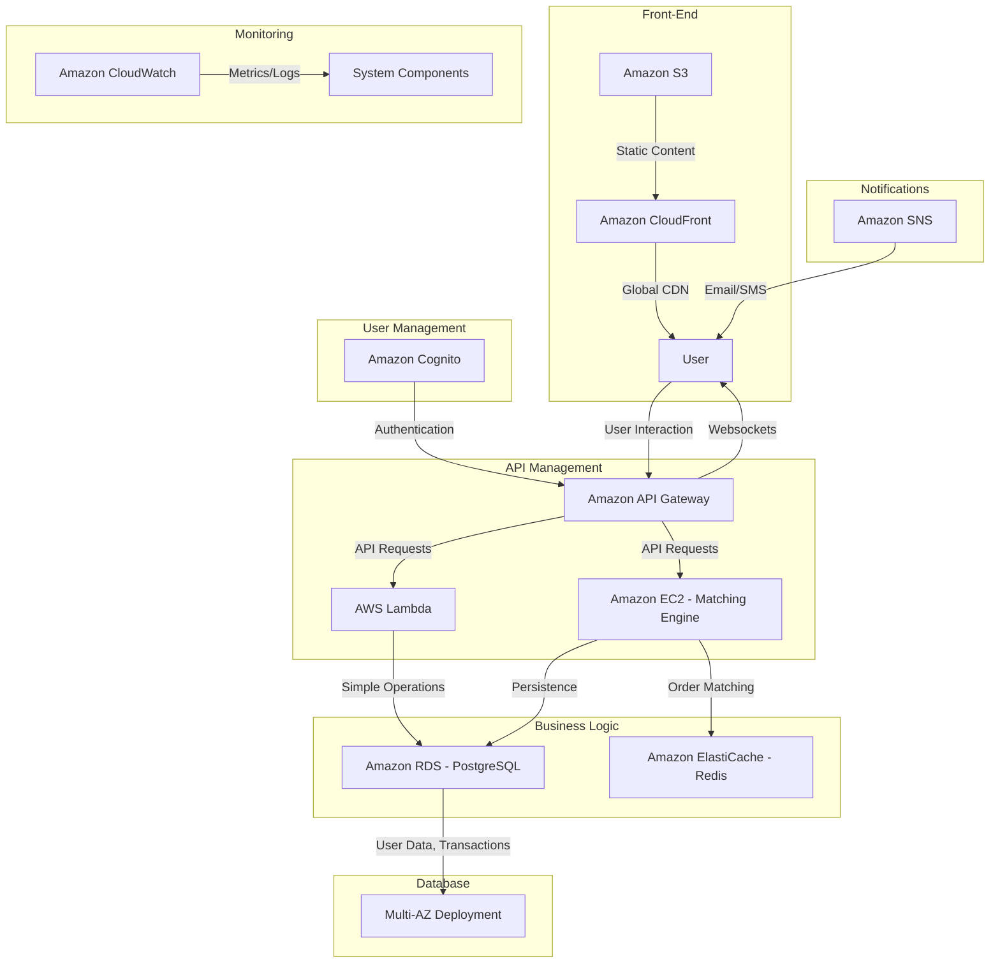

# Key Points
- Designed a highly available trading system using AWS, similar to Binance, handling 500 requests per second with p99 response time <100ms.
- Key components include S3 and CloudFront for front-end, API Gateway for APIs, Lambda and EC2 for business logic, RDS for databases, and ElastiCache for order books.
- System ensures scalability through Auto Scaling, load balancing, and managed services, with cost-effectiveness via serverless options.
# Front-End and API
- The front-end is hosted on Amazon S3 with Amazon CloudFront for fast, global content delivery, ensuring users experience quick load times.
- API Gateway manages all API requests, integrating with backend services for scalability and ease of management.
# Core Components
- The Matching Engine, critical for order matching, runs on EC2 instances in an Auto Scaling group, balanced by Elastic Load Balancer (ELB), using Amazon ElastiCache (Redis) for in-memory order book storage to meet low latency needs.
- Amazon RDS with PostgreSQL, in a multi-AZ setup, stores user data and transaction history, ensuring high availability.
#  Additional Features
- Amazon Cognito manages user authentication and authorization, simplifying secure access (better management than IAM).
- Notifications are handled by Amazon Simple Notification Service (SNS) for emails/SMS and API Gateway websockets for real-time updates.
- Amazon CloudWatch monitors performance and logs errors, ensuring system health.
# Diagram
